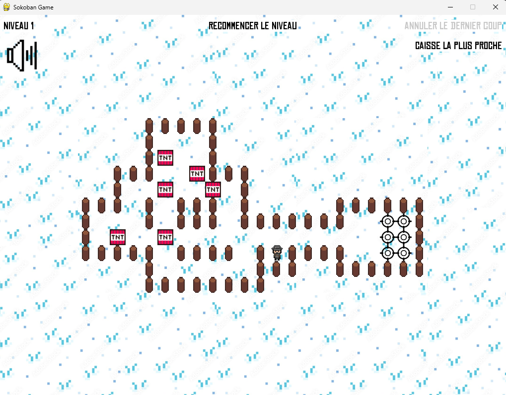

# Red Dead Redemption Sokoban 🎮🤠

A Sokoban puzzle game themed around *Red Dead Redemption*, built with **Pygame**.

## 🕹️ Controls
- Move your character using **ZQSD** (French AZERTY layout):
  - **Z** → Up
  - **Q** → Left
  - **S** → Down
  - **D** → Right

> *(For QWERTY users: this corresponds to WASD.)*

## 🧭 Pathfinding Feature
Press the designated button to reveal the **shortest path** to solve the current level — calculated using a pathfinding algorithm.

## 🛠️ Built With
- [Pygame](https://www.pygame.org/) — For game rendering and input handling
- Custom pathfinding algorithm — To compute optimal moves

## 📦 How to Run
1. Ensure you have Python and Pygame installed:
   ```bash
   pip install pygame


